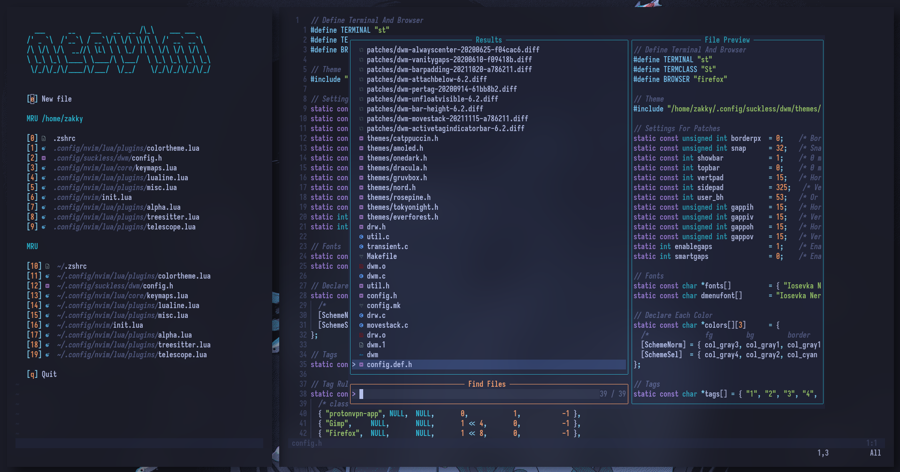

<h1 align="center">Neovim</h1>

My tokyonight theme neovim configuration!

##

## Requirements / Dependencies
* Arch
`sudo pacman -S nodejs npm luarocks`
* Debian
`sudo apt install nodejs npm luarocks`
* Gentoo
`sudo emerge -va nodejs npm yarn luarocks`

## Installation
`git clone https://github.com/zakky20/nvim.git` & `sudo mv nvim ~/.config`

## License
This project is licensed under [GPL-3.0](https://raw.githubusercontent.com/Illumina/licenses/master/gpl-3.0.txt).
